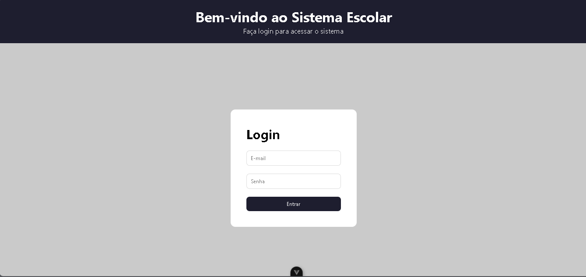
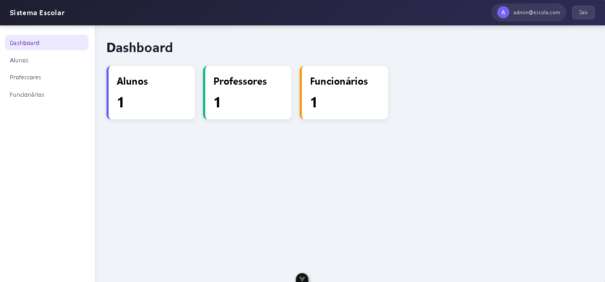
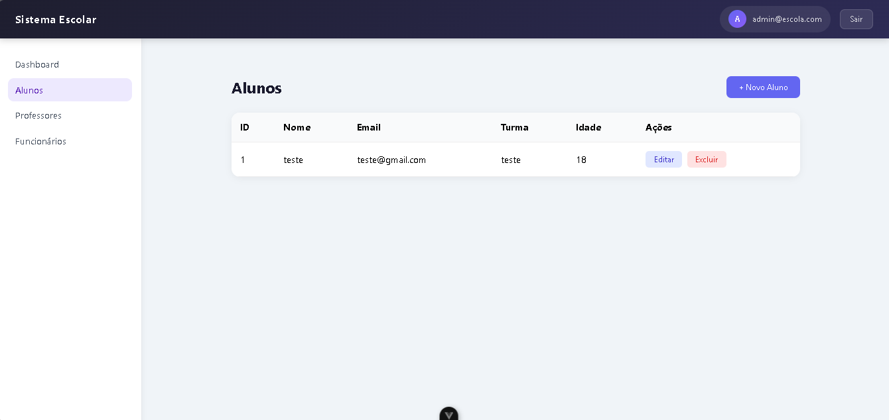
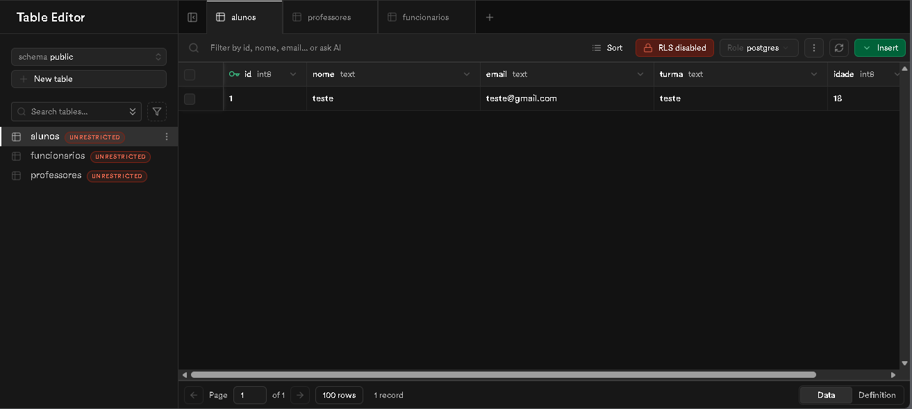
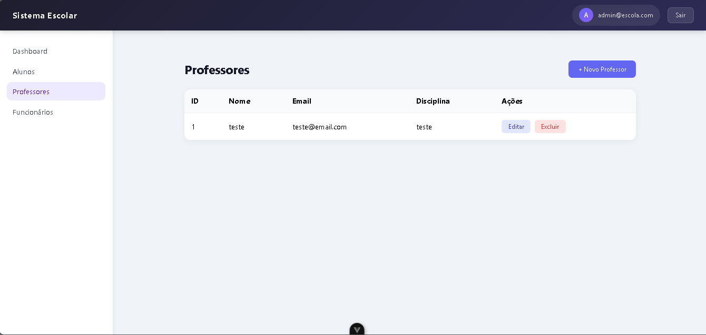
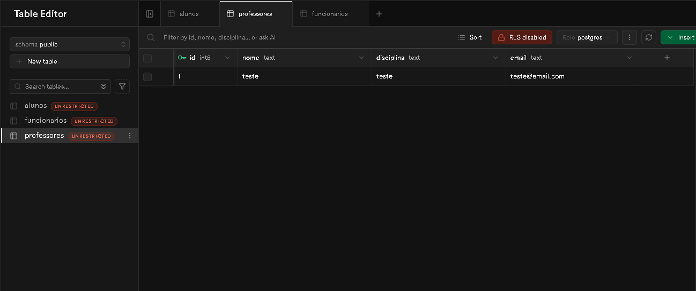
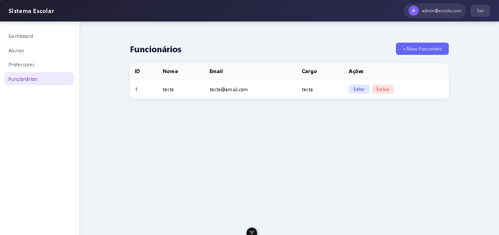
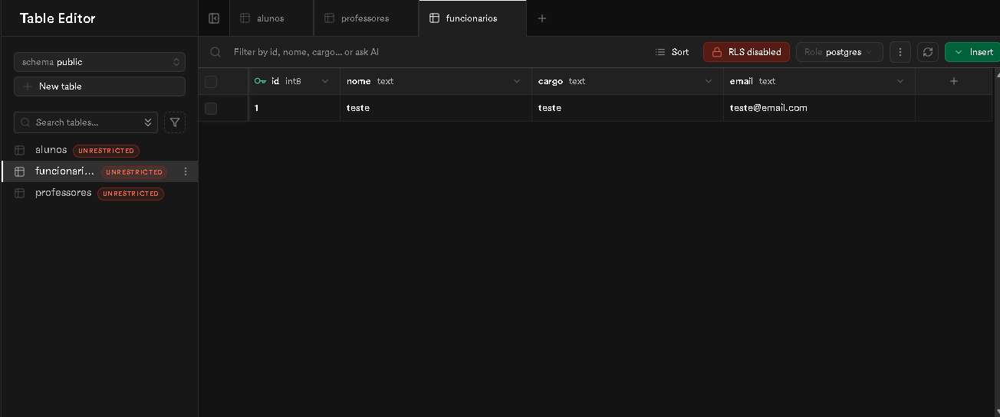

# Sistema Escolar

Sistema web desenvolvido para gerenciamento escolar, permitindo o controle de alunos, professores e funcionários.

---

# Tecnologias Utilizadas

## Frontend
- Vue.js 3
- Vue Router
- Pinia
- Axios
- CSS3

## Backend
- Node.js
- Express
- MySQL(SUPABASE)

---

# Funcionalidades

## Autenticação
- Login de usuário
- Proteção de rotas privadas

## Alunos
- Cadastro de alunos
- Listagem de alunos
- Edição de alunos
- Exclusão de alunos

## Professores
- Cadastro de professores
- Listagem de professores
- Edição de professores
- Exclusão de professores

## Funcionários
- Cadastro de funcionários
- Listagem de funcionários
- Edição de funcionários
- Exclusão de funcionários

## Interface
- Navbar moderna
- Sidebar responsiva
- Modais reutilizáveis
- Componentização com Vue
- Tabelas reutilizáveis

---

# Estrutura do Projeto

```bash
src/
│
├── components/
│   ├── Button.vue
│   ├── Input.vue
│   ├── Modal.vue
│   ├── Navbar.vue
│   ├── Sidebar.vue
│   └── Table.vue
│
├── views/
│   ├── LoginView.vue
│   ├── DashboardView.vue
│   ├── AlunosView.vue
│   ├── ProfessoresView.vue
│   └── FuncionariosView.vue
│
├── router/
│   └── index.js
│
├── stores/
│   └── auth.js
│
├── services/
│   └── api.js
│
├── App.vue
└── main.js
```

---

# Como Executar o Projeto

## Clonar o repositório

```bash
git clone URL_DO_REPOSITORIO
```

---

## Instalar dependências

```bash
npm install
```

---

## Executar o frontend

```bash
npm run dev
```

---

## Executar o backend

```bash
node server.js
```

ou

```bash
npm run dev
```

---

# Login de Teste

```txt
E-mail: admin@escola.com
Senha: admin
```

---

# Funcionalidades do Sistema

- Dashboard administrativo
- Navegação protegida
- CRUD completo
- Interface responsiva
- Componentes reutilizáveis
- Sistema modularizado

---

# Aprendizados no Projeto

Durante o desenvolvimento foram utilizados conceitos como:

- Componentização
- SPA (Single Page Application)
- Rotas protegidas
- Gerenciamento de estado com Pinia
- Consumo de API REST
- CRUD completo
- Responsividade
- Organização de projeto Vue.js

---

---

# Prints Funcionamento

















---

# Autores

Desenvolvido por **Marcus Mikael Rodrigues Vieira**.

Desenvolvido por **Marcos Andre dos Santos Soares**.